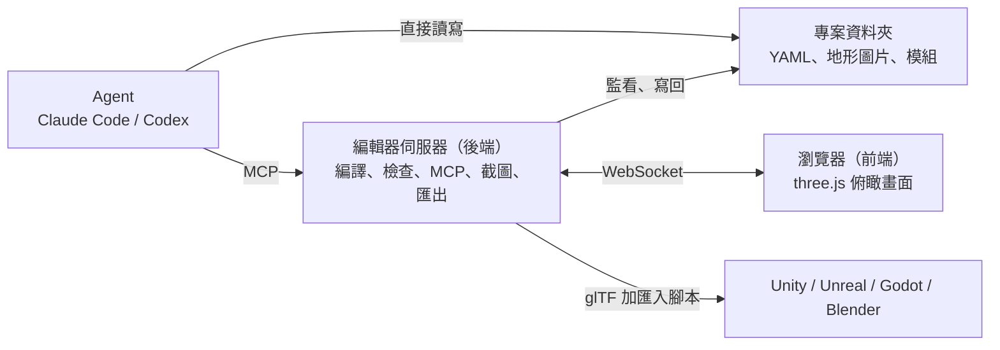

# 設計文件：3D 通用地圖編輯器

> 暫定名稱：`mapedit`（之後可以改）
> 狀態：第一版設計定案（2026-10-05）
> 用語見 [CONTEXT.md](../CONTEXT.md)；重要決定的理由見 [docs/adr/](adr/)；前後端之間的介面見 [protocol.md](protocol.md)。

## 1. 這是什麼

一個主要給 Agent 用、其次給人用的 3D 遊戲地圖編輯器。

- **Agent**（在使用者電腦上執行的 Claude Code 或 Codex）直接改地圖檔、用程式建模，並透過 MCP 指令檢查、查詢和截圖。
- **編輯器**像編譯器：讀地圖檔，算出每個東西的精確位置，檢查穿模、浮空等違規，並在瀏覽器裡即時顯示。
- **人**在瀏覽器裡看 Agent 蓋東西，用像玩遊戲一樣的操作做簡單修正。
- 成果匯出成 glTF，再透過各引擎的匯入腳本，變成 Unity、Unreal、Godot、Blender 裡可以直接玩的關卡。

### 為什麼要做

- Blender 和遊戲引擎的地圖編輯器太複雜，學習成本太高。
- 讓 Agent 直接操作引擎（例如透過 Unity MCP）常見的問題：Agent 看不到全貌、場景資料太大塞爆上下文、一步一步呼叫太慢、東西互相穿插或浮在空中。

## 2. 設計原則

1. **Agent 優先**：Agent 是主要使用者，人是次要使用者。
2. **人只出想法和做簡單修正，精確度交給程式**：人的介面只有遊戲式操作，不放數值參數。
3. **嚴格**：不准穿模、不准浮空、比例不能失衡。有違規的地圖不能匯出。
4. **編輯器不含 AI**：需要生成式 AI 時，由 Agent 自己透過別的 MCP 呼叫，再把結果匯入。
5. **地圖就是文字檔**：Agent 用它最擅長的讀寫文字來工作，git 記錄所有歷史。
6. **不綁引擎**：同一張地圖可以匯出到四個引擎。

## 3. 一次完整的流程

1. `npx mapedit init my-maps`：建立專案，內含基本模組、範例地圖、給 Agent 的說明書和 MCP 設定。
2. `npx mapedit dev`：啟動編輯器，瀏覽器打開俯瞰畫面。
3. 你跟 Claude Code 說：「蓋一個有三間房子、一條路和出生點的小村莊。」
4. Agent 讀說明書和模組清單，用 MCP 指令改地形、寫結構檔，再呼叫 `check` 看違規、`screenshot` 看成果，自己修到零違規。
5. 你在瀏覽器裡即時看到過程。發現一棵樹太靠近房子，直接拖開。
6. `npx mapedit export --out <Unity 專案>/Assets/Maps`：Unity 自動匯入，出生點換成你的玩家 prefab，按 Play 就能走進房子。

## 4. 空間規則

| 項目 | 規則 |
|---|---|
| 單位與座標 | 一律用公尺。Y 軸朝上；+X 是東，-Z 是北（和 Minecraft 相同）。 |
| 格子 | 一格 0.5 公尺。所有位置和高度都必須是 0.5 的倍數。檔案裡直接寫公尺（例如 `12.5`），不寫格數，避免 Agent 換算出錯。 |
| 地圖 | 長和寬各在 100 到 1000 公尺之間，整張一次載入。 |
| 模組 | 尺寸固定，不能縮放；要不同大小就做成不同尺寸的模組。在結構裡只能轉 90 度。 |
| 結構 | 一群用插槽接在一起的模組，有自己的格子。整個結構擺在地圖格點上，每次轉 15 度。兩個結構用插槽接起來就合併成一個。 |
| 插槽 | 有位置、朝向和類型。插槽類型決定誰能接誰，例如地基邊緣只能接牆或地基。編輯器內建常用類型，專案可以自己新增類型和相容規則。 |
| 吸附 | 人拖動東西時，程式自動對齊格子或相容的插槽。 |
| 支撐 | 每個模組底下都要有東西撐著（地面、下方的模組或插槽），一路往下要接到地面。模組可以標明「可以浮空」作為例外。編輯器不計算受力。 |
| 地基 | 地面不平時，地基在低的一側自動往下延伸到地面，高的一側埋進地形；延伸部分的樣子由地基模組決定。地形不會被改動。 |

## 5. 地形

- 由 1 × 1 公尺的地塊組成。每個地塊有一個高度（0.5 公尺一階）和一種地表（草地、沙地、泥土、道路等）。
- 程式自動把高低差修成平順的斜坡和崖壁，外觀不會是一格一格的方塊。
- 存成兩張圖片（高度一張、地表一張）。1000 × 1000 公尺的地圖有 100 萬個地塊，寫成文字會塞爆 Agent，所以 Agent 用指令改地形，例如「這裡堆一座山」「把這塊整平」「沿這條線鋪道路」。
- 樹、石頭是貼在地形上的模組，不屬於地形。
- 水（之後的版本）：河和湖的水面要比河床高，所以地塊除了高度，還會有一個水位。

## 6. 違規

| 違規 | 說明 |
|---|---|
| 穿模 | 兩個模組的實際形狀互相重疊；只碰到表面不算。地基和貼地的模組可以埋進地形，其他模組不行。 |
| 插槽不相容 | 接在不相容的插槽上。 |
| 沒有支撐 | 違反上面的支撐規則。 |
| 不在格子上 | 位置或高度不是 0.5 的倍數，或旋轉角度不合規定。 |
| 超出地圖 | 有東西超出地圖範圍。 |
| 找不到引用 | 引用了不存在的模組、插槽、結構或材質。 |
| 檔案格式錯誤 | YAML 寫錯，或欄位不合格式。 |

- 檔案可以暫時有違規，就像程式寫到一半會有編譯錯誤；編輯器會立刻標出來。
- 只要有違規，地圖就不能匯出。
- 給 Agent 的違規報告會附上修正建議，例如「往東移 0.5 公尺就不會重疊」。

## 7. 專案與檔案

```text
my-maps/                       ← 專案
├── project.yaml               ← 專案設定：自訂插槽類型與相容規則、標記類型
├── modules/
│   └── wood_wall_2m/          ← 一個模組一個資料夾
│       ├── module.yaml        ← 尺寸、插槽、是否為地基、可不可以浮空
│       └── model.ts           ← 程式生成的建模程式（之後也可以是匯入的 model.glb）
├── materials/                 ← 專案自己的材質（內建材質庫不用放這裡）
├── maps/
│   └── village/
│       ├── map.yaml           ← 地圖設定：名稱、大小、太陽
│       ├── terrain/
│       │   ├── height.png     ← 地形高度
│       │   └── surface.png    ← 地表
│       ├── structures/        ← 結構檔
│       │   ├── house_01.yaml
│       │   └── props_market.yaml
│       └── markers.yaml       ← 標記
├── AGENTS.md                  ← 給 Agent 的說明書（Codex 會自動讀取）
└── .claude/skills/mapedit/    ← 給 Claude Code 的 skill
```

- 一個結構檔可以放一個或多個結構：大的結構自己一個檔；零散的小東西（木箱、路燈、單獨一棵樹）可以放在同一個檔。
- 用插槽接上去的模組不寫座標，只寫「接在哪個插槽上」，座標由編輯器算。
- YAML 可以寫註解，Agent 可以留下「這是東邊的瞭望塔」這類筆記。人在網頁上修改時，編輯器寫回檔案會保留這些註解。
- 專案資料夾可以獨立存在，也可以放在遊戲的 repo 裡。
- 這裡說的 AGENTS.md 是 `init` 產生在使用者專案裡、教 Agent 怎麼蓋地圖的說明書，和編輯器本身原始碼 repo 的開發說明無關。

結構檔大概長這樣（只是示意，正式格式由後端定義在 `docs/map-format.md`）：

```yaml
# 東邊的瞭望塔
structures:
  - id: watchtower_east
    position: [120, 48]        # x、z（公尺，0.5 的倍數）；高度自動貼合地形
    rotation: 30               # 度，15 的倍數
    modules:
      - id: base
        module: stone_foundation_2x2
        at: [0, 0, 0]
      - id: wall_n
        module: wood_wall_2m
        attach: { socket: bottom, to: base.edge_north }
      - id: wall_e
        module: wood_wall_2m_door
        attach: { socket: bottom, to: base.edge_east }
```

## 8. 外型與材質

- **程式生成**：Agent 在模組的 `model.ts` 裡，用編輯器提供的建模 API（底層是 manifold-3d）寫出形狀，例如「2 × 3 公尺的木板，中間挖一個門洞」。形狀不能超出宣告的尺寸。
- **外部素材**（之後的版本）：匯入 glb 模型，編輯器自動校正到宣告的尺寸。
- **材質**：
  - 內建材質庫：一組有名字的材質，例如木板、石磚、瓦片、草地、金屬、純色。貼圖只用 CC0 素材（例如 ambientCG、Poly Haven）。
  - 程式寫的貼圖、匯入的貼圖（之後的版本）。程式寫的貼圖在匯出前要先轉成圖片。
  - 貼圖一律照真實尺寸自動貼上，同一種磚在每面牆上都一樣大。Agent 只需要挑材質，不用處理 UV。
- **碰撞體**：程式根據模組外型自動產生。
- **燈光**：第一版只有一個太陽；火把、路燈這類會發光的模組之後再做。

## 9. Agent 介面

- **地圖檔**：Agent 直接讀寫。
- **MCP**（主要的指令管道；工具名稱可以由後端調整）：

| 工具 | 用途 |
|---|---|
| `overview` | 地圖摘要：大小、結構清單、標記、違規數量 |
| `check` | 檢查違規，附修正建議 |
| `screenshot` | 一張圖拼好幾個角度（俯視加四個斜角），可以只看某個區域或結構 |
| `floor_plan` | 某個結構每一層的文字版平面圖 |
| `query` | 某個位置有什麼：地形高度、地表、物件 |
| `free_sockets` | 某個結構還有哪些空著的插槽，各自能接哪些模組 |
| `modules` | 模組清單：尺寸、插槽、特性 |
| `build_module` | 建出某個模組，回報錯誤並附預覽圖 |
| `terrain` | 改地形：堆高、挖低、整平、鋪地表、堆山 |
| `export` | 匯出 |

- **CLI**：`init`、`dev`、`check`、`export`、`mcp`（用 stdio 提供 MCP）。`check` 有違規時回傳非零的結束代碼，可以放進 git hook 或 GitHub Actions。
- **說明書**：`init` 會在專案裡產生 AGENTS.md 和 Claude Code skill，教 Agent 地圖檔格式、指令和工作流程。
- **語言**：給 Agent 的內容（說明書、工具說明、違規訊息）用英文，Agent 讀英文最穩定，也最省 token。
- **查證過的注意事項**：
  - 工具回傳要精簡。Claude Code 單次回傳超過約 1 萬 token 會警告，預設上限約 2.5 萬。
  - 截圖用 MCP 的圖片格式回傳，而且同一個回覆不能帶 `structuredContent`，否則 Codex 會把圖片丟掉（[openai/codex#10334](https://github.com/openai/codex/issues/10334)）。
  - Codex 不一定肯自己打開圖片檔（[openai/codex#12439](https://github.com/openai/codex/issues/12439)），所以截圖不能只存成檔案。

## 10. 人的介面

- **第一版**：只有俯瞰模式。可以看、點選、拖動整個結構或標記（自動對齊格子、按 R 每次轉 15 度、高度自動貼合地形）、刪除、復原和重做。違規用紅色標出。
- **拖動規則**：拖動時會顯示預覽。預覽變紅，代表放下去會造成違規，就放不下去，跟建造遊戲一樣。
- **之後的版本**：第一人稱模式（像 Minecraft 創造模式）、用快捷欄放新模組、把模組拖到別的插槽。
- 只有遊戲式操作：快捷欄、點擊、拖曳、按鍵。沒有數值面板，也沒有三軸箭頭。
- 介面語言：繁體中文和英文。
- 人和 Agent 同時改到同一個東西時，以後改的為準，並跳出提示。所有修改（不管是人還是 Agent 做的）都能在編輯器裡復原，git 也留有完整紀錄。

## 11. 匯出

- 格式：glTF（.glb）。保留層級（地圖 → 地形、結構 → 模組）、材質、碰撞體和標記；遊戲用的資料放在 glTF 的 extras 欄位。
- 每個引擎一個匯入腳本，把 extras 變成遊戲物件：碰撞體變成 Collider、觸發區變成 Trigger Collider、標記換成你指定的 prefab。
- 第一版只做 Unity 的匯入腳本，基於 UnityGLTF（它的匯入外掛在 Editor 裡讀得到 extras）。
- 可以直接輸出到 Unity 專案的 Assets 資料夾，Unity 會自動匯入。
- 其他引擎在腳本完成前，也收得到模型、層級和標記資料：Godot 4.4 起放在節點的 meta，Blender 會變成自訂屬性，Unreal 5.5 起會匯入，但讀取方式要實測。

## 12. 技術架構



- 全部用 TypeScript（pnpm monorepo），3D 顯示用 three.js，幾何核心用 manifold-3d，授權 MIT。
- `mapedit dev` 啟動一個本機程序，同時提供網頁、WebSocket 和 MCP（Streamable HTTP），只接受本機連線。
- 截圖：後端用無頭瀏覽器打開前端的 `/render` 頁面來產生，所以 Agent 看到的畫面和人看到的一致。
- 套件與分工：

| 位置 | 內容 | 負責 |
|---|---|---|
| `packages/core` | 領域模型、地圖檔讀寫、編譯、規則檢查、地形運算、建模 API、glTF 產生 | Codex |
| `packages/protocol` | 前後端之間的訊息型別（依 protocol.md） | Codex |
| `packages/server` | 本機伺服器：監看檔案、WebSocket、MCP、截圖、修改紀錄 | Codex |
| `packages/cli` | `mapedit` 指令 | Codex |
| `packages/web` | 瀏覽器介面、`/render` 截圖頁面 | Claude |
| `integrations/unity` | Unity 匯入套件 | Codex |
| `templates/project` | `init` 用的專案範本：基本模組、範例地圖、AGENTS.md、skill | Codex |

## 13. 第一版範圍

**包含**

- Agent 從頭到尾的流程：寫地圖檔 → 檢查 → 看截圖和違規報告 → 修正 → 匯出
- MCP 和 CLI（第 9 節列的全部指令）
- 一組基本模組（程式生成）：地基、地板、牆、有門的牆、有窗的牆、屋頂、樓梯；材質從內建材質庫挑
- Agent 可以自己寫新模組
- 地形（堆高、挖低、整平、鋪地表）和地基自動延伸
- 整個結構每次轉 15 度
- 兩種標記：出生點、觸發區
- 俯瞰模式：看、點選、拖動、刪除、復原
- Unity 匯入腳本
- AGENTS.md 和 Claude Code skill

**完成標準**

Claude Code 和 Codex 都能只靠一句話（例如「蓋一個有三間房子、一條路和出生點的小村莊」）做出零違規的地圖；匯出到 Unity 後，出生點自動換成玩家 prefab，按 Play 就能走進房子。

## 14. 之後的版本

- 第一人稱模式、用快捷欄放新模組、把模組拖到別的插槽
- 散佈區（例如一整片森林）
- 匯入外部素材（模型、貼圖）、程式寫的貼圖
- 水位（河、湖）
- 會發光的模組
- Unreal、Godot、Blender 的匯入腳本
- 一鍵把地圖送進已經開著的引擎
