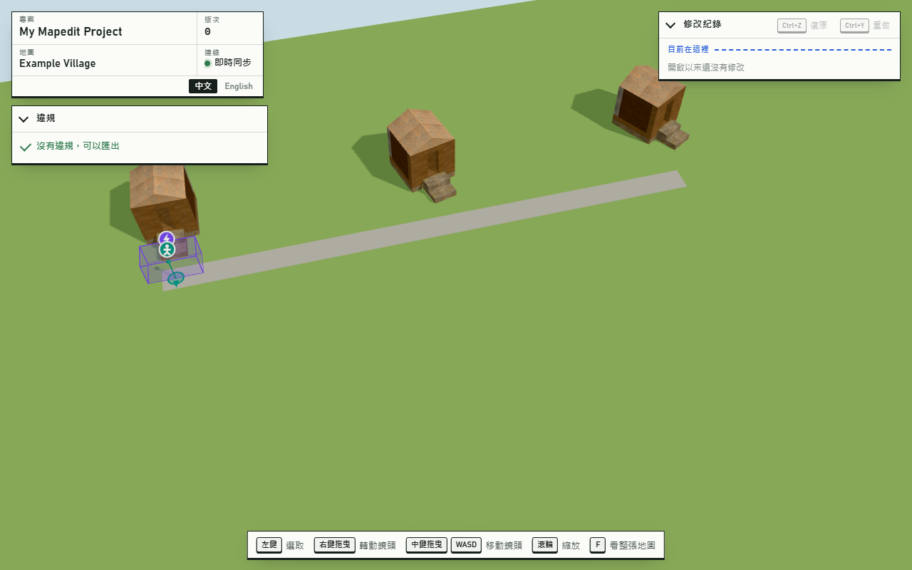
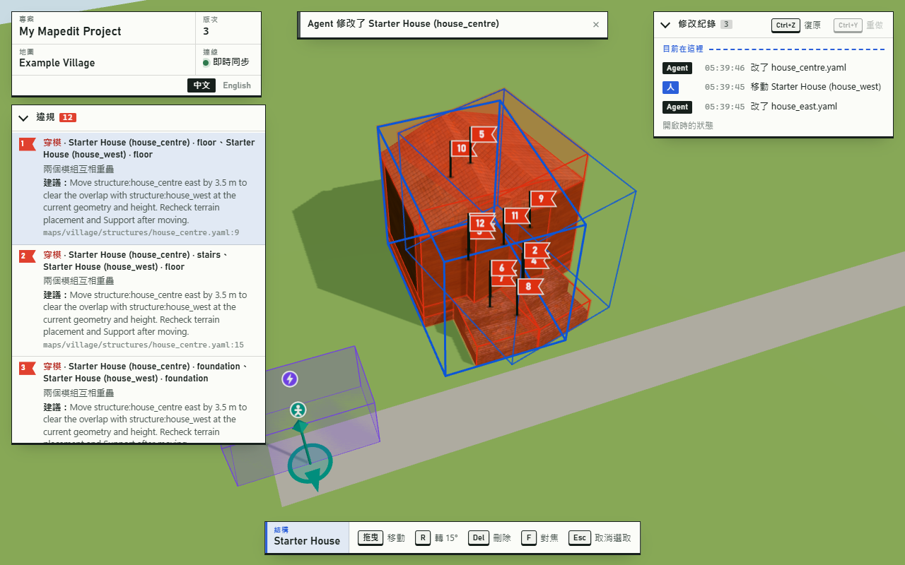
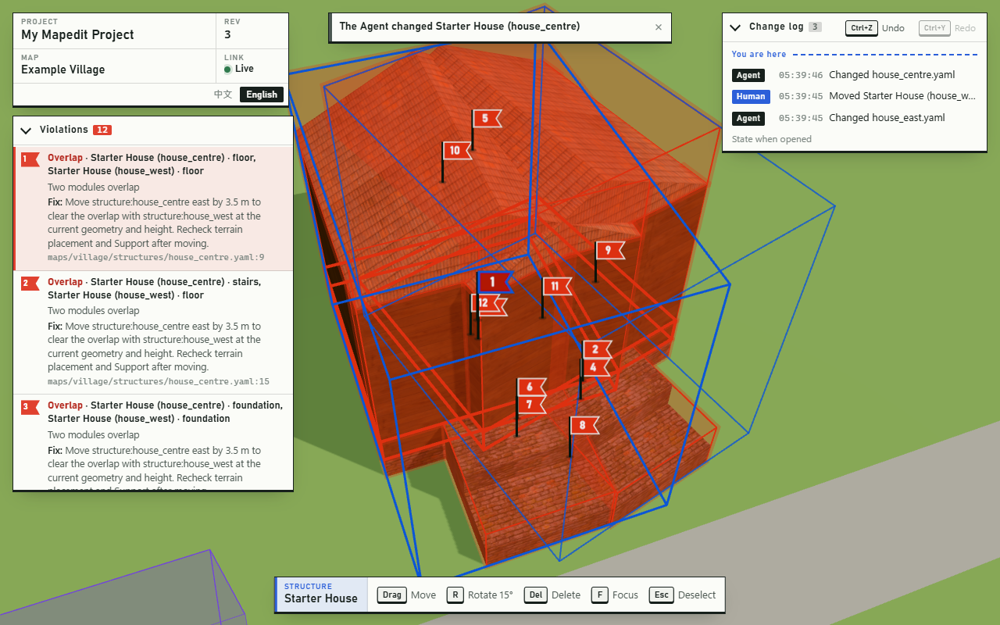
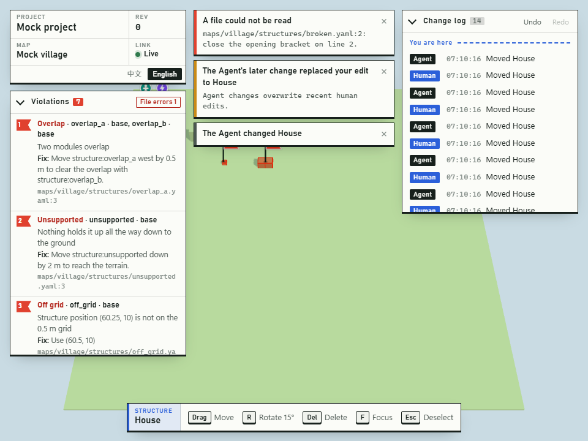
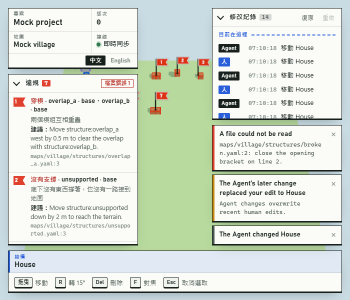

# Frontend implementation status

`packages/web` is the browser editor and the `/render` screenshot page. It follows
[claude-frontend.md](claude-frontend.md) and [protocol.md](../protocol.md); the backend
is not modified here.

**檢查入口：**
- W0–W6、[第一輪修正](#第一輪修正)（FE1–FE23）、[第二輪修正](#第二輪修正)（FE24–FE30）全部完成。
  FE30 曾因收尾取消，使用者在收尾後決定補做。
- PR #1–#3 已合併進 `main`（25c730e），`frontend` 是經由 PR #2 合併的。`main` 已含後端的 F38–F42、F44 和 F40 的
  Windows 修正。
- FE30 和配合後端 F40 的處理在分支 `fe30`，從 `main` 開出。
- 這台 Windows 上，`fe30` 的 `pnpm install --frozen-lockfile`、`pnpm build`、`pnpm typecheck`、`pnpm lint`、`pnpm test`
  全部通過，沒有略過：89 個檔案、569 個測試，其中前端 26 個檔案、189 個測試，含 8 個用 headless Edge 實際操作的
  瀏覽器測試檔。

程式從 `packages/web/src/main.ts` 開始：`editor/` 是編輯器（`editor.ts` 把連線、場景、輸入、編輯和介面接在一起），
`render/` 是截圖頁，`scene/` 是兩者共用的 three.js 畫面（`map-view.ts` 管地形和整體，模組、標記、違規標示
各有一個類別），`net/connection.ts` 是 WebSocket 客戶端，`i18n/` 是兩種語言的文字。
W6 時 [PR #2](https://github.com/Karylcode/mapedit/pull/2) 的 CI（[run 37237237682](https://github.com/Karylcode/mapedit/actions/runs/37237237682)）
在 Windows／Ubuntu × Node 22／24 四個組合全部通過；PR #2 合併前最後一次 CI
（[run 37260342720](https://github.com/Karylcode/mapedit/actions/runs/37260342720)，757aa46）也是四個組合全部通過。
CI 上找不到瀏覽器會讓測試失敗（FE22），所以瀏覽器測試一定會實際執行。

## 目前進度

| 階段 | 狀態 | 驗收 |
|---|---|---|
| W0 骨架 | 完成 | `test/connection.test.ts`、`test/i18n.test.ts`；mock 上實際畫面 |
| W1 畫出場景 | 完成 | `test/map-view.test.ts`、`test/snapshot-index.test.ts`、`test/camera-math.test.ts`；mock、真的村莊和 1000 × 1000 公尺地圖的實際畫面 |
| W2 俯瞰操作 | 完成 | `test/overview-controls.test.ts`、`test/selection.test.ts`、`test/editor-browser.test.ts`（真的 Edge） |
| W3 編輯 | 完成 | `test/editing-logic.test.ts`、`test/edit-browser.test.ts`（mock）、`test/real-edit-browser.test.ts`（真的專案） |
| W4 違規、提示、語言 | 完成 | `test/notices.test.ts`、`test/issues-browser.test.ts`（真的 Edge，中英文） |
| W5 `/render` | 完成 | `test/render-views.test.ts`、`test/render-browser.test.ts`（頁面契約，以及真的專案透過 MCP `screenshot`、`build_module`） |
| W6 端到端 | 完成 | `mapedit dev` 提供的正式建置上走完 `pnpm e2e` 村莊；全部測試、lint、typecheck；README |

## 每個階段完成了什麼、怎麼驗證

- **W0**：Vite 8 + TypeScript strict + three.js 的 `@mapedit/web`。根目錄 `pnpm build`
  在 `tsc -b` 之後執行 `vite build`，`tsc -b` 也型別檢查 web；ESLint 與 Vitest 的既有設定
  已涵蓋 `packages/web`。Vite 開發伺服器把 `/api`、`/assets`、`/ws` 轉給
  `MAPEDIT_BACKEND`（預設 `http://127.0.0.1:4790`），並改寫 `Host`（`changeOrigin`）
  與 `Origin`（HTTP 有帶時、WebSocket 一律）。WebSocket 客戶端：`hello` → `welcome` →
  `openMap`，斷線後退避重連並重新開啟目前的地圖；格式不明的伺服器訊息直接忽略。
  畫面左上角的「圖框」顯示專案名稱、地圖、版次和連線狀態，並可切換語言。
  驗證：`connection.test.ts` 用假 socket 測流程、重連、request 編號、版本不相容，
  另外對真的 mock 伺服器測 `welcome`/`scene`/`history` 和伺服器重啟後自動重連；
  瀏覽器預覽 `pnpm mapedit dev --mock` + Vite，畫面顯示 Mock project、Mock village、
  版次 0、即時同步。

- **W1**：`MapView` 把快照畫成 three.js 物件：地形切塊（同一種地表共用一個材質）、
  模組（每個模組類型的每個 primitive 一個 `InstancedMesh`）、地基延伸、點標記（地面圓盤、
  朝向箭頭、桿子）和方形標記（半透明方塊加邊線），標記上方有固定螢幕大小的圖示。
  太陽依 `azimuth`/`elevation` 打光並投影，陰影範圍跟著鏡頭。glb 以網址快取，新快照只載入
  網址變了的地形切塊、模組類型和地基延伸；模組矩陣、標記和違規標示每次重算；不再被引用的
  glb 會釋放。換地圖時先清掉舊地圖。找不到模組類型（或 glb 載入失敗）的模組畫成紅色半透明
  方塊，不會整個消失。違規：紅色玻璃方塊和紅框包住相關物件，`location` 插上編號的測量旗，
  遠的旗子會縮小。標題列可以切換地圖，載入中顯示進度。
  驗證：`map-view.test.ts` 對 mock 伺服器的真 glb 測每一種資料、點選、只重新載入變動的部分、
  釋放不用的 glb、換地圖；瀏覽器實測 mock、`pnpm e2e` 的村莊（貼圖、轉 15/30 度的房子、山、
  道路），以及 1000 × 1000 公尺、1,024 個地形切塊、400 棟房子（3,200 個模組）、103 個違規的
  地圖：伺服器建好之後 9.4 秒載完 1,090 個 glb；看整張地圖時每個畫面中位數 8.7 ms、
  90% 在 12 ms 內（`gl.finish()` 計時，含陰影，2,311 次 draw call、400 萬個三角形）。
- **W2**：鏡頭是遊戲式的狀態（看著的地面點、方位角、俯角、距離）。右鍵拖曳轉動（地圖跟著游標走）、
  中鍵拖曳平移（抓住的地面點留在游標下）、WASD／方向鍵平移（速度跟距離成正比）、滾輪往游標縮放
  （游標下的點不動）、F 平滑飛到選取的東西（沒有選取就看整張地圖；系統設定減少動態時直接跳過去）。
  看的點不能離開地圖超過地圖邊長的 10%（至少 10 公尺），距離和俯角有上下限，看的點會貼著地形高度。
  滑過時顯示名牌（種類、名稱、所屬結構、違規數），並用細的粉線藍框標出「現在點下去會選到什麼」。
  點選：第一次選整個結構，再點同一個結構裡的模組就只選那個模組；標記直接選；點空地或 Esc 取消。
  底部的動作列顯示選取的東西和能用的按鍵，沒有選取時顯示怎麼看地圖。
  驗證：`overview-controls.test.ts` 測轉動方向和上下限、平移時抓住的點不動、WASD 方向、縮放時游標下的點不動、
  不會飛出地圖、平滑對焦；`selection.test.ts` 測點選規則、Agent 刪掉選取的東西時清掉選取、名牌與按鍵提示；
  `editor-browser.test.ts` 用 Vite 建置後由 mock 伺服器提供、在 headless Edge 裡用真的滑鼠和鍵盤測：
  名牌、結構→模組選取、標記選取、點空地取消、Esc、F 對焦、右鍵轉動、中鍵平移、滾輪縮放、WASD，且沒有頁面錯誤。
- **W3**：在結構或標記上按住左鍵拖曳，出現半透明的預覽（用模組真正的形狀；標記用方塊）和
  0.5 公尺的吸附格子。每個畫面最多送一個 `previewEdit`；還沒收到回覆時只保留最新的一個，
  完全沒變的位置不重送。預覽的位置以後端回的 `transform` 為準（對齊格子、高度由後端決定）。
  `ok` 為 false 時預覽變紅，游標旁出現紅色名牌：「放不下」和違規種類（中文）加上後端的英文訊息。
  放開時送 `applyEdit`（帶開始拖動時的 `baseRevision`），預覽留著直到新的快照到達；
  被拒絕就讓預覽消失、物件留在原處，並跳出提示和原因。Esc 取消拖動。
  R（Shift+R 反方向）：拖動中轉預覽（繞著游標點轉，物件留在游標下）；沒有拖動時把選取的結構或
  標記繞著自己的中心轉 15 度並直接套用。選到模組時，拖動和 R 作用在它所屬的整個結構。
  Delete／Backspace 刪除選取的結構、單一模組或標記；Ctrl+Z 復原，Ctrl+Y 或 Ctrl+Shift+Z 重做，
  按住鍵不放不會重複套用。右上角的「修改紀錄」列出每次修改是人還是 Agent、時間（本地時間）、
  做了什麼（人的移動和刪除顯示物件名稱，Agent 的修改顯示改了哪些檔案），虛線標出目前停在哪一步，
  已復原的項目變淡；面板可以收起（記在 localStorage，讀寫都包 try/catch），上面也有復原、重做按鈕。
  驗證：`editing-logic.test.ts` 測預覽節流（一次只有一個在路上、只留最新的、不重送、離線不送）、
  旋轉數學和修改紀錄的文字；`edit-browser.test.ts` 在 headless Edge 對 mock 測拖動成功（有預覽、
  有 `previewResult`、放下後位置對齊 0.5 公尺、紀錄出現「人」）、拖到地圖外變紅並顯示原因、
  放下被拒絕彈回並提示、R、拖動中 R、Delete、Ctrl+Z、Ctrl+Y、Ctrl+Shift+Z（沒有可重做的提示）、
  按鈕復原、第二次點選後只刪單一模組、Esc 取消拖動；`real-edit-browser.test.ts` 對 `templates/project`
  的真專案測同樣的流程：拖動後 `house.yaml` 的 `position` 更新且開頭的註解還在、R 寫入
  `rotation: 15`、刪掉 `stairs` 後 Ctrl+Z 復原、拖動出生點後 `properties` 不變，以及手動改 YAML
  （模擬 Agent）時網頁即時更新、紀錄記成 Agent。
- **W4**：左邊「違規」面板依快照順序列出每一筆違規，編號和地圖上的旗子一致：違規種類（介面語言）、
  相關物件名稱、後端的訊息和建議、來源 `檔案:行`；檔案錯誤另列，顯示檔名和行號。點一筆違規，鏡頭飛過去，
  它的旗子變大、相關物件加上粗紅框；再點一次或 Esc 取消。沒有違規時顯示「沒有違規，可以匯出」。
  `notice` 依 `code` 翻成提示：Agent 修改（列出物件名稱，同時短暫用藍框標出被改的物件，連續修改會合併成
  一則）、人的修改被 Agent 蓋掉、人蓋掉 Agent 的修改、修改被拒絕（和拖動結果共用同一則，不會重複）、
  檔案無法讀取（同一個錯誤在修好前只提示一次，因為後端每次重建都會重送）。後端的英文訊息有額外資訊時當作細節顯示。
  語言：預設跟瀏覽器（任何中文都用繁體中文），標題列可以切換，記在 `localStorage`（讀寫都包 try/catch），
  切換時所有介面文字（包含已經顯示的提示）都跟著換，`<html lang>` 也更新。
  驗證：`notices.test.ts` 測每一種 notice 兩種語言的文字、細節和合併鍵、檔案錯誤只提示一次、每一種違規的名稱、
  物件清單過長時縮短；`issues-browser.test.ts` 在 zh-TW 的瀏覽器裡測：預設繁體中文、七種違規都列出來（含建議和
  來源行號）、檔案錯誤、點違規後鏡頭移動並標出物件、Esc 取消、用 `POST /api/mock/trigger` 觸發五種 notice 都有
  正確的中文提示、切到英文後標題列、面板、動作列、違規名稱、已顯示的提示都變英文，重新整理後還是英文。
  合併 `backend`（F17–F23 與地形材質修正）之後，違規的訊息改成依 protocol.md 第 3 節的 `params` 翻譯：
  七種違規都有兩種語言的說明（例如「結構位置 (60.25, 10) 不在 0.5 公尺的格子上」「超出地圖東邊 1 公尺」
  「插槽類型 roof 和 stair 不能接在一起」）；不在格子上、角度、超出地圖這三種直接寫在檔案裡的值，建議也由
  `params` 產生（「改成 (60.5, 10)」「往西移 1 公尺，就會回到地圖裡」），其他建議沿用後端的英文。
  `params` 不符合表格時（用 `violationParamsProblems` 檢查）退回後端的英文訊息。拖動時游標旁的原因也用同一套翻譯。
- **W5**：`/render` 和編輯器共用同一份 bundle（依網址載入不同的程式，截圖頁不載入任何介面和樣式）。
  頁面一開就把 `mapeditRenderReady` 設成 false，用 `GET /api/scene` 載入快照和所有 glb 之後設成 true；
  WebGL 建不起來或地圖不存在時也會設成 true，讓 `mapeditRender` 直接丟出清楚的錯誤，不會讓後端等到逾時。
  `mapeditRender(spec)`：等快照的 revision 到 `minRevision`（每 100 ms 重新抓，最多 20 秒），依
  `showViolations`（預設 true）畫違規、用粉線藍框標出 `highlight`，每個角度畫一格：`top` 用正交鏡頭從
  正上方看、北方朝上；`ne`、`nw`、`se`、`sw` 從那個方位、高度角 35 度的上空看中心。有 `focus` 就照
  它取景，沒有就取整張地圖（`top` 框住地圖的長方形，斜角在不切到角落的前提下拉近）。一到三個角度排成一列，
  四、五個排成兩列；每格左上角標角度名稱，`top` 右上角畫指北針；多出來的格子寫地圖名稱、revision、大小、
  違規數。沒有地形的地圖（`build_module` 的預覽）會加上地面和 0.5 公尺格線。頁面上沒有任何元素，
  所有資源都是同一個來源（貼圖、圖示、字都在執行時畫）。
  驗證：`render-views.test.ts` 測鏡頭方向（top 北上東右、四個斜角在對的方位）、取景、排版；
  `render-browser.test.ts` 用和後端一樣的方式（擋掉非同源請求）打開 `/render`：頁面沒有元素、拼圖大小、
  角度標籤、指北針、俯視中央是地形、`showViolations` 和 `highlight` 有作用、`minRevision` 會等到新版本、
  錯誤的參數和不存在的地圖會回錯誤訊息；並對 `templates/project` 的真專案用 MCP SDK 呼叫 `screenshot`
  （整張地圖 5 個角度、單一結構 2 個角度）和 `build_module`，都拿到 PNG 圖片、沒有 `structuredContent`。
  實測（這台 Windows、headless Edge、GPU）：village 整張 1.2 秒、單一結構 1.0 秒、模組預覽 0.7 秒、
  1000 × 1000 公尺地圖 3.2 秒（從啟動伺服器、第一次建置算起）。下面是真的伺服器透過 MCP `screenshot`
  拿到的圖：

  整張村莊（`{"map":"village","tileSize":384}`）：

  

  單一結構（`{"map":"village","structure":"house_centre","tileSize":256}`）：

  

  `build_module` 的模組預覽（`{"module":"wall_door"}`）：

  

  1000 × 1000 公尺、400 棟房子、103 個違規的地圖（`{"map":"big","tileSize":384}`）：

  
- **W6**：`pnpm build` 之後，在 `pnpm e2e` 產生的村莊執行 `mapedit dev`，`http://127.0.0.1:4790` 直接是編輯器
  （`/render` 和圖示也由後端提供）。用 headless Edge 走一遍（腳本記錄在下面）：畫面正確（三間房子、轉
  15／30 度、道路、山、出生點和觸發區，沒有違規）；直接改 `house_east.yaml`（模擬 Agent），網頁不用重新整理
  就畫出新位置，出現「Agent 修改了 Starter House (house_east)」並短暫框出那棟房子；人把 `house_west` 拖走，
  檔案寫回 `position: [26.5, 20.5]`、開頭註解還在，修改紀錄是「Agent、人」；再讓 Agent 把 `house_centre` 移到
  和 `house_west` 重疊，出現 12 個穿模違規和旗子，切成英文、點第一個違規也正常；把檔案改回去後回到零違規。
  全程沒有頁面錯誤。同名的結構（三棟都叫 Starter House）在清單、提示和紀錄裡會附上 id 區分。
  README 補上執行方式、編輯器操作表和前端開發方式。驗證：上面各階段的測試，加上整個 repo 的測試全部通過。

  打開時（`mapedit dev`，正式建置）：

  

  Agent 造成穿模之後（左邊違規清單、地圖上的編號旗子、右邊修改紀錄）：

  

  切成英文、點第一個違規：

  

## 第一輪修正

依 [frontend-fixes.md](frontend-fixes.md)（FE1–FE23）逐項修正，一項一個 commit。
- 程式錯誤（FE1–FE17、FE19、FE20）：先寫能重現問題的測試，確認它失敗，再修到通過。
- FE18：只改文件。
- FE21、FE22：修的是測試本身。新的斷言盡量確認過「功能壞掉時會失敗」，各項的說明有寫怎麼確認的。
- FE23：重構，靠既有和新增的測試確認行為不變。
- FE17 要等後端的 F34、F35，所以先做 FE18、FE19，再回來做 FE17。

- **FE1 完成**：模組類型的模型改成每個網址只註冊一次載入回呼，載完（或失敗）時重畫一次；
  其他快照到達時不會再替同一個網址加回呼。測試：`test/map-view-loading.test.ts`，20 種模組一個接一個載完，
  `refresh()` 不超過 20 次（修正前同一個測試是 6,022 次以上，測試在 500 次時就停止繼續呼叫）。
- **FE2 完成**：模組類型換模型時沿用原本的實例緩衝區大小，只有實例數超過容量時才加倍。測試：同一個檔案，
  40 面牆的模型換 20 次，緩衝區大小不變（修正前變成 41,943,040 個實例）。
- **FE3 完成**：換地圖時取消拖動和手勢、清掉選取和滑過提示；新地圖的第一份快照畫出來之前，點選和滑過都沒有作用，
  拖動、R、Delete 都不送修改。修改的 `baseRevision` 只取「畫面上就是目前地圖」時的 revision，沒有就不送，不再用 0 代替。
  測試：`test/maps-browser.test.ts` 用有兩張地圖、兩邊都有 `structure:house` 和 `marker:player_spawn` 的真專案，
  以 Playwright 攔下第二張地圖的快照：等待期間點選、Delete、R、拖動都沒有送出任何 `applyEdit`／`previewEdit`，
  放行後第二張地圖的檔案沒有被改（修正前會送出 `delete structure:house`，`baseRevision` 是 0）。
- **FE4 完成**：Vite 代理只在 `Origin` 是開發伺服器自己（等於 `http://<請求的 Host>`）時改寫成後端的來源，
  其他網站的 `Origin` 原樣轉送，由後端拒絕；沒有 `Origin` 的請求也不會被加上。代理設定移到 `packages/web/dev-proxy.ts`。
  測試：`test/dev-proxy.test.ts` 測 `forwardedOrigin`，並實際啟動 Vite 開發伺服器接到 mock 後端：自己頁面的
  WebSocket 升級和 `POST /api/mock/trigger` 通過，`http://evil.example` 的都被後端以 403 拒絕
  （修正前外部網站的 WebSocket 升級會成功，回 101）。這也補上了 W0 代理沒有自動測試的缺口。
- **FE5 完成**：每個物件記住已送出、但新快照還沒反映的修改。沒有拖動時連按 R，從最後送出的位置和角度接著轉；
  已送出刪除的物件不再重送刪除，也不再轉動；修改等回覆期間在那個物件上拖曳，不會變成平移，
  而是跳出「上一個修改還在處理中，請稍等再拖」。收到失敗回覆就忘掉那筆；成功的等新快照到達後才忘掉。
  測試：`test/edit-controller.test.ts`（用假連線直接測 `EditController`）：快速按三次 R 送出 15、30、45 度
  （修正前三次都是 15 度）；按兩次 Delete、回覆成功但快照未到時再按一次，都只送一個刪除、沒有錯誤提示；
  等回覆期間拖曳回傳 `blocked` 並顯示提示。
- **FE6 完成**：Ctrl+Z、Ctrl+Y（和 Ctrl+Shift+Z）忽略按住不放時的重複按鍵，只作用一次；這樣 W3 寫的
  「按住鍵不放不會重複套用」才是真的。測試：`test/keys-browser.test.ts` 在瀏覽器裡送出重複的按鍵事件，
  只送出一個 `undo`（修正前是三個）。
- **FE7 完成**：快捷鍵集中到 `editor/keys.ts` 的 `shortcutFor`：Z、Y、R、F 這些字母指令看 `event.key`（不分大小寫），
  Delete、Backspace、Escape 也看 `event.key`；WASD 和方向鍵是方向，照舊看 `event.code`。Escape 依序取消拖動、
  取消點選的違規、取消選取。測試：`test/keys.test.ts` 測各種鍵盤配置和組合鍵；`test/keys-browser.test.ts` 在瀏覽器裡
  送出德文（QWERTZ）和法文（AZERTY）鍵盤的事件：印著 Z 的鍵加 Ctrl 會復原、印著 Y 的鍵會重做
  （修正前德文鍵盤的 Ctrl+Z 會重做）。
- **FE8 完成**：`pointercancel`、`lostpointercapture` 和視窗失去焦點時，結束目前的手勢；還沒放下的拖動直接取消
  （預覽消失、不套用），平移也會結束。測試：`test/edit-browser.test.ts` 對三種中斷各測一次：拖動中送出事件後
  預覽消失、不再是拖動狀態，接著 Delete 會正常送出（修正前預覽一直留著）。
- **FE9 完成**：放下並收到 `editResult { ok: true }` 之後，最多再等 2 秒新快照，時間到就移除預覽；成功但還沒
  反映在快照上的修改也最多擋 2 秒，物件之後可以再拖。放下後、回覆前按的 Ctrl+Z／Ctrl+Y 會排隊，收到回覆後送出
  （拖動中仍然不作用）。放下後回覆前斷線，提示改成「連線中斷，不確定剛才的修改有沒有套用；重新連線後以畫面為準」。
  測試：`test/edit-controller.test.ts`（假計時器）：成功但沒有快照時，2.5 秒後預覽消失、可以再拖；放下後馬上按
  Ctrl+Z，回覆到了才送出 `undo`；放下後斷線顯示新的提示（三項修正前都失敗）。
- **FE10 完成**：`Connection` 記住目前這條連線已經開過哪張地圖：`welcome` 時先重新開啟目前的地圖，再通知監聽器；
  同一條連線上開同一張地圖不會再送。測試：`test/connection.test.ts` 模擬編輯器在 `welcome` 時開地圖，第一次連線和
  重連各只送一個 `openMap`，換地圖時仍然照送（修正前第一次連線送兩個）。
- **FE11 完成**：新快照的地圖大小和上一份不同時，更新鏡頭的範圍（不重新取景），F 也框住新的大小。
  測試：`test/real-edit-browser.test.ts` 把真專案的 `map.yaml` 從 100 改成 400 公尺，鏡頭的最大距離和邊界跟著變成
  640 和 40 公尺，按 F 看到整張 400 公尺的地圖（修正前停在 160 和 10 公尺）。
- **FE12 完成**：接在別的結構上的結構不會單獨出現在快照裡（它的模組畫在根結構下面，但 ref 仍是
  `module:<自己的 id>/…`）。`SnapshotIndex` 用 `parseObjectRef` 把 `structure:B` 對應到所有 `module:B/*` 的實例，
  所以違規的紅色標示、清單點選後飛過去、選取和 Agent 修改的藍框、`/render` 的 `highlight` 都找得到它；它的外框
  用根結構的格子、只框它自己的模組，名稱顯示自己的 id。測試：`test/attached-structures.test.ts` 用「annex 接在 house
  上、違規只寫 `structure:annex`」的快照：被標紅、有範圍可以飛過去和框出來（修正前什麼都沒有）。另外用真的編譯器
  確認過這種快照的形狀：annex 的模組出現在 `structure:house` 裡、ref 是 `module:annex/base`。
- **FE13 完成**：伺服器資料裡出現介面還不認得的東西時，畫面照常更新：
  - 不認得的違規種類，標題顯示種類名稱，說明和建議用後端的英文。
  - 不認得的提示代碼，提示框顯示後端的英文訊息，等級照後端給的。
  - 不認得的修改紀錄作者，照原樣顯示。
  - `translate` 遇到沒有的 key 回傳 key 本身，不丟錯誤。
  - `Store` 和 `Connection` 的每個監聽器各自 try/catch，錯誤記到 console，不影響其他監聽器。
  - `VIOLATION_KINDS` 改用 `@mapedit/protocol` 匯出的清單，`NOTICE_CODES` 也是。
  - 同時接上後端 F30 新增的 `unknown_map`：
    - 提示「專案裡已經沒有這張地圖，可能剛被刪除」，後端的英文說明附在下面。
    - 畫面回到這條連線原本開著的地圖。
    - `Connection` 依序記錄送出的 `openMap`。被拒絕的是目前想開的地圖時，才退回伺服器開著的那張，並重新要一份快照。
      在回覆前又換了別張地圖的話，不會退回。

  測試：
  - `test/unknown-data.test.ts`：不認得的種類、代碼、作者，和兩種丟錯誤的監聽器。修正前前五項失敗。
  - `test/notices.test.ts`：改用協定的清單，並確認每個種類和代碼都有翻譯。
  - `test/connection.test.ts`：`openMap` 的回覆順序。修正前停在被拒絕的地圖。
  - `test/maps-browser.test.ts`：真專案刪掉一張還沒開過的地圖，再從選單選它。結果是出現提示，選單、網址和畫面都回到原本的地圖，而且仍然可以點選。拿掉退回的步驟後，這個測試失敗。
- **FE14 完成**：地圖選單選完後立刻失去焦點，方向鍵和 WASD 回到移動鏡頭。
  測試：`test/maps-browser.test.ts` 先讓選單取得焦點再換地圖，接著按住 W 和下方向鍵：鏡頭移動，地圖和選單都沒變
  （修正前按 W 鏡頭不動）。
- **FE15 完成**：還沒收到 `welcome` 就被以 1008 關閉時，表示伺服器讀不懂 `hello`（協定版本不同）。這時停止重連，
  狀態變成「伺服器版本不相容」。收到 `welcome` 之後的 1008 照常重連。
  測試：
  - `test/connection.test.ts`：假連線測兩種時機的 1008。
  - `test/editor-browser.test.ts`：用 Playwright 攔下 WebSocket 當成假伺服器，收到 `hello` 就以 1008 關閉。
    畫面顯示版本不相容，1.5 秒內只連了一次（修正前一直顯示「連線中」）。
- **FE16 完成**：介面改成 CSS grid，各部分各占一格，不會互相蓋住：
  - 左欄是標題和違規清單，右欄是修改紀錄，下面一列是操作列。
  - 左右欄寬度是 `clamp(260px, 30vw, 360px)`，視窗窄時跟著變窄。
  - 寬度 900 像素以上，提示放在兩欄中間；更窄時放在修改紀錄下面。
  - 寬度 600 像素以下（手機）排成一欄，提示浮在最上面。
  - 修改紀錄太窄時，復原、重做按鈕省略按鍵圖示，不會擠成兩行或被切掉。
  - 720 像素以下，修改紀錄預設收起（原本就是這樣）。

  測試：`test/editor-browser.test.ts` 在 960 × 720 和 700 × 600 下，同時有違規清單、展開的修改紀錄（14 筆）
  和三個提示。標題、違規清單、修改紀錄、操作列和每個提示，兩兩之間都不重疊，也都在視窗裡面
  （修正前 960 寬時提示蓋住標題）。修正後的畫面：

  

  

- **FE17 完成**（後端 F28、F34、F35 合併之後；FE18、FE19 先做完）：前端不再比對或解析後端的英文文字。
  - 復原、重做看 `failure` 是不是 `nothing_to_undo`、`nothing_to_redo`，不再比對 `Nothing to undo`。
  - 失敗原因看 `failure`：
    - `file_errors`：拖動時游標旁顯示「有檔案無法讀取，修好之前不能移動」；放下被拒時，這句放在提示裡。
    - `unknown_object`、`immovable_object`、`internal_error`：各有翻譯。
    - 其他原因（例如 `violations`）：照原樣顯示後端的英文 `reason`。
  - 修改紀錄用 `action` 和 `refs` 寫出「移動 House」「刪除 House · roof」。Agent 的修改列出檔案。
    沒有 `action` 的項目照原樣顯示 `summary`，不解析。
  - `/render` 看 `map.kind === 'module_preview'` 決定地面格線、取景和圖例，不再看 `__module_` 開頭的 id。
  - 提示的 `mapId` 不是畫面上的地圖時：
    - 不用目前地圖的名稱，改成「「Second Map」上的 house」，用 id 加上地圖名稱。
    - 不框任何東西。
    - 每張地圖的 Agent 修改提示各自一則，不會互相取代。
  - 後端改成先送 `scene` 再送 `agent_changed` 之後，提示裡用的是改名後的新名稱。
  - `file_error` 提示的重複過濾不再比對訊息內容：每則訊息顯示一次，等專案裡所有檔案都能讀取之後才重新計算。
    剩下的錯誤看違規清單的「檔案錯誤」。

  測試：
  - `test/edit-controller.test.ts`：四項，修正前都失敗。
    - 理由寫著 `Nothing to redo…` 的 `internal_error` 算失敗；`nothing_to_undo` 不看理由。
    - 預覽和放下遇到 `file_errors` 時的文字。
  - `test/history-text.test.ts`、`test/editing-logic.test.ts`：從 `action`、`refs` 寫出紀錄，`summary` 不被解析。
  - `test/notices.test.ts`：別張地圖的提示寫出地圖名稱、不用目前地圖的物件名稱。`file_error` 的過濾不讀訊息內容。
  - `test/render-views.test.ts`：id 是 `__module_…` 但 `kind: 'map'` 的照地圖寫圖例，`kind: 'module_preview'` 的照預覽寫。
  - `test/maps-browser.test.ts`（真專案，兩張地圖都有 `structure:house`）：
    - Agent 改另一張地圖的 house：提示是 `The Agent changed house on Second Map`，畫面上的 house 沒有被框
      （修正前提示寫成目前地圖的名稱，也框了目前地圖的 house）。
    - Agent 把目前地圖的 house 改名：提示用新名稱，並框住它。
- **FE18 完成**：protocol.md 第 4 節 `Edit` 的說明改成實際的意思：`position` 是物件原點想放的位置（還沒對齊），
  也就是結構的 `position`、點標記的 `position` 或方形標記的 `center`，不是滑鼠指到的點。前端送的和後端 `snapMove`
  的解讀本來就一致，只改文件，沒有程式測試。已通知後端。
- **FE19 完成**：提示超過 4 則時，先移掉最舊的一般資訊，再來才是最舊的警告，錯誤最後才移。只剩警告和錯誤時，
  新來的一般資訊直接不顯示。
  測試：
  - `test/toasts.test.ts`：測挑選要移掉哪一則的 `overflowVictim`。
  - `test/editor-browser.test.ts`：先顯示一則警告，再來四則一般資訊，警告還在，被移掉的是第一則資訊
    （修正前警告被擠掉）。
- **FE20 完成**：
  - 載入失敗的模組模型，下一份快照到達時會重新載入。重新載入期間，先繼續顯示紅色方塊。
    地形和地基延伸原本就會重試。
  - 每次畫面更新都會檢查像素比例，和 renderer 不同時重新設定大小。瀏覽器縮放會觸發 ResizeObserver；
    移到不同縮放比例的螢幕時，`resolution` 媒體查詢會要求畫一次。
  - 測試：
    - `test/map-view-loading.test.ts`：模型第一次載入失敗後，下一份快照再要一次，成功後紅色方塊換成模型
      （修正前不會再要）。
    - `test/editor-browser.test.ts`：用 CDP 把像素比例從 1 改成 2（CSS 大小不變），移動滑鼠之後，
      畫布變成 2560 像素寬（修正前停在 1280）。
    - 備註：headless Edge 用 CDP 改像素比例時，不會觸發 `resolution` 媒體查詢的 `change` 事件，
      所以測試走的是「下一次畫面更新」這條路。
- **FE21 完成**：補上缺的測試，並讓原本可能永遠通過的斷言在功能壞掉時會失敗。
  - 每個瀏覽器測試都收集頁面錯誤和 `console.error`（`harness.ts` 的 `watchErrors`、`pageErrors`），
    每個檔案最後確認沒有錯誤；測試中途另開的頁面，在關閉前也會檢查。
  - `edit-browser.test.ts`：
    - Esc 取消拖動：先確認預覽真的出現過。原本拖的 `out_of_bounds` 在地圖東邊，被右邊的修改紀錄蓋住，
      滑鼠按在面板上，所以從來沒有拖起來過，「預覽消失」一直是空洞地成立。現在先把鏡頭移到它上方再拖，
      測完再還原鏡頭。
    - 新增 Shift+R 反方向轉 15 度。
    - 新增 Backspace 刪除。
    - 新增「`baseRevision` 取自拖動開始時」：拖動中用 mock 觸發 Agent 移動同一棟房子。放下時送出的
      `baseRevision` 等於開始拖動時的 revision，並出現「你放下的位置蓋掉了 Agent 的修改」提示。
      把程式暫時改成用放下時的 revision，這個測試會失敗。
  - `editor-browser.test.ts`：四個方向鍵各自讓鏡頭移動，方向和對應的 W、S、A、D 相同。
  - `real-edit-browser.test.ts`（真專案）：
    - 新增「放下被拒絕」：拖出地圖西邊，提示 `Starter House was not moved`，檔案和 revision 都沒變。
    - 原本的「復原」之後加上「重做」：Ctrl+Y 再刪一次樓梯。
  - `render-browser.test.ts`：
    - `showViolations`、`highlight` 改成數像素：
      - 開違規後，旗紅的像素多出 1,000 個以上；實測從 58 個變成 2,210 個，58 個是北方箭頭。
      - `highlight` 有 200 個以上的粉線藍像素，而且不顯示違規。
    - 會記錄頁面嘗試連到其他網站的請求，最後確認一個都沒有。
    - MCP 的 `screenshot`、`build_module` 解碼後，第一格中央區域要有 8 種以上的顏色（以 16 為一階）。
      實測 24 到 70 種；空白畫面只有 1、2 種。只看中央是因為標籤和北方箭頭即使 3D 畫面空白也會畫出來。
  - `issues-browser.test.ts`：
    - 點違規之後，`focused` 必須是被點的那一筆。
    - 切成英文後，`.hud` 的可見文字和 `aria-label`／`title` 完全沒有中文字（只排除切回「中文」的按鈕），
      不再用五個詞的黑名單。
  - `notices.test.ts`：違規種類和提示代碼在 FE13 已改用協定的清單。現在也走訪後端 F37 匯出的參數清單
    （`OFF_GRID_FIELDS`、`ROTATION_FIELDS`、`MAP_EDGES`、`MISSING_REFERENCE_REASONS`、`SOCKET_PROBLEMS`、
    `OVERLAP_TARGETS`），每個值都要有翻譯。
  - 換地圖已由 FE3、FE13、FE14 的 `maps-browser.test.ts` 涵蓋。
  - 這份文件開頭 W6 時寫的「6 個瀏覽器測試檔」改正為 5 個；現在共有 7 個。
- **FE22 完成**：
  - 找瀏覽器和啟動參數改用 `@mapedit/server` 匯出的 `findBrowser`、`SCREENSHOT_BROWSER_ARGS`，和截圖服務同一份。
    這樣也補上了使用者自己安裝的 Chrome、macOS 的 Edge 和 `--disable-dev-shm-usage`。
  - 有 `CI` 環境變數時找不到瀏覽器會直接報錯，不再默默略過。
  - Vite 每次測試只建置一次：
    - 根目錄 `vitest.config.ts` 加了 `globalSetup`（`test/browser/global-setup.ts`），只建立一個暫存資料夾，結束時刪除。
    - 第一個呼叫 `buildWeb()` 的瀏覽器測試負責建置，其他 worker 等它完成後共用。
    - 只跑後端測試時完全不建置。原本每個瀏覽器測試檔各建置一次，共 8 次。
  - 固定等待後只讀一次的地方改成輪詢到條件成立：
    - 拖動預覽變成 `ok`；
    - 按住 WASD、方向鍵時鏡頭移動；
    - FE14 換地圖後按鍵。
    - 另外拿掉拖動中按 R、調整視窗大小之後不需要的等待。
    - 留下的固定等待只用在確認「某件事沒有發生」（不送修改、不重連），旁邊都有說明。
  - `connection.test.ts` 不再把伺服器重開在剛關掉的連接埠上：
    - 頁面連到一個固定位址的小代理，伺服器每次重開都用新的連接埠，代理跟著轉過去。
    - 代理會把 `Host` 改寫成後端自己的位址，因為後端會檢查它。
  - 新增 `test/dev-command-browser.test.ts`：
    - 確認 Vite 的輸出資料夾就是 `mapedit dev` 預設會找的 `SERVER_WEB_ROOT`（`packages/web/dist`）。
    - 用編譯好的 CLI 在暫存專案執行 `mapedit dev --port 0`，瀏覽器打開 `/`，編輯器畫出範本村莊，沒有錯誤；
      打開 `/render?map=village`，能截出 PNG。
    - `packages/web/dist` 已經是這份原始碼的建置時（Vite 的檔名由內容決定，比較 `index.html` 就知道），直接用。
    - 不是的話，在 CI 上先換上新的建置。換的時候先複製到旁邊再一次改名，伺服器不會讀到寫到一半的資料夾。
    - 本機則略過並提示先跑 `pnpm build`，因為打包 CLI 會複製 `packages/web/dist`，
      同時替換它可能干擾旁邊正在跑的 packed-CLI 測試；CI 是一個檔案接一個檔案跑。
  - W0 的 Vite 代理已在 FE4 補上自動測試。
- **FE23 完成**：
  - 重複的程式：
    - 面板開關的記憶改用共用的 `editor/preferences.ts`（`rememberedFlag`、`rememberFlag`）。
    - 每個介面檔各自宣告的 `t`，改用 `i18n.ts` 的 `translator(lang)`；需要跟著目前語言的，用 `liveTranslator`。
    - `MapView.frameOf` 改用 `@mapedit/protocol` 的 `markerPosition`。
  - 提示的 key `edit:<ref>` 改成 `hud/toasts.ts` 的 `editToastKey(ref)`，編輯結果和 `edit_rejected` 提示共用。
  - 用語：`/render` 的 `floor`／`placeFloor` 改成 `groundPlane`／`placeGroundPlane`；縮放時的 `anchor` 改成 `pivot`。
  - 刪掉沒用到的 `Viewport.onResize`、`OverviewCamera.focus`、`OverviewCamera.mapSize`、`OverviewControls.moving`、
    `MapView.dispose`。原本用 `moving` 的測試，改成輪詢鏡頭飛到預期的位置。
  - 拆開 `MapView`，只更新有變的部分：
    - `ModuleBatches`（`scene/module-batches.ts`）：模組的 instancing、染色和替代方塊。
    - `MarkerLayer`（`scene/marker-layer.ts`）：標記；只有標記本身或標記的違規變了才重建。原本任何違規變動都會重建。
    - `ViolationMarks`（`scene/violation-marks.ts`）：旗子、紅色玻璃和外框。
    - 模型載入完成時只重畫模組；在清單上點違規，只換旗子和焦點外框，不再整個 `refresh()`。
  - 測試：
    - `test/map-view.test.ts`：新增「點違規不會重畫模組和標記」。
    - `test/map-view-loading.test.ts`：FE1 的測試改成同時計算完整重畫和只重畫模組的次數，避免拆開之後變成空洞的斷言。
- **CI 修正（b5da89d 之後）**：Ubuntu／Node 24 上，FE8 的 `lostpointercapture` 測試等不到拖動預覽。
  - 原因：整張地圖在畫面中時，這個檔案裡大多數物件的按壓點都落在畫面上方中間那一欄，也就是提示疊放的地方。
    Ubuntu 的字型比較寬，提示換行後變高，蓋住了按壓點，滑鼠按到的是提示，所以拖動沒有開始。
    本機量到的是：房子的按壓點在 y = 178；到這一輪時已經疊了三則提示，最下面在 y = 165。
  - 用 CSS 把提示加高到 62 px 就能在本機重現：被蓋住的換成另一個測試；那個測試等了 15 秒，提示消失，
    FE8 反而通過了。CI 上也是同樣的情形，只是先中招的剛好是 FE8。
  - 修法：`harness.ts` 新增 `pressPoint`。點擊前先把鏡頭對準物件，讓它在畫面中央，並確認那一點最上層的元素是地圖的 canvas；
    被蓋住時立刻失敗，並指出是哪個元素。`edit-browser.test.ts` 的每個點擊、`maps-browser.test.ts` 在錯誤提示出現後
    點房子的地方都改用它。
  - 驗證：所有編輯器頁面的提示都加高到 90 px 時，7 個瀏覽器測試檔仍然全部通過。

## 第二輪修正

依 [frontend-fixes-2.md](frontend-fixes-2.md)（FE24–FE30）逐項修正，一項一個 commit；程式錯誤先寫會失敗的測試。

**結果：FE24–FE30 全部完成。**
- 使用者原本決定收尾合併，FE30 因此取消；FE29 在收到收尾通知之前已經做完、測過並提交，所以保留。
- 收尾時沒有合併 `backend`：後端的 F38–F40 還沒推上 GitHub，而 FE30 需要 F39 的欄位。
- PR #1–#3 合併進 `main` 之後，使用者決定補做 FE30。FE30 和配合後端 F40 的處理原本留在本機分支
  `frontend-round2-backend-merge`，現在從 `main` 開出分支 `fe30`，用 cherry-pick 放上去。
  那個本機分支裡合併 `backend` 的 commit 沒有拿，因為後端的 commit 已經在 `main` 上。

- **FE24 完成**（FE9 的後續）：放下之後、回覆之前按的 Ctrl+Z／Ctrl+Y，改成存在那一次拖動上，等於綁定那次放下的
  request id。
  - 放下成功才送出。
  - 放下被拒絕時丟掉，並提示「這次放下沒有套用，所以之後按的復原或重做也沒有送出」。
  - 取消拖動（包括換地圖、斷線）時跟著那次拖動一起消失。

  測試：`test/edit-controller.test.ts`，兩項修正前都失敗。
  - 放下被拒絕後，排隊的 `undo` 沒有送出，並出現提示。
  - 放下後按 Ctrl+Z，接著換地圖，舊的回覆之後才到；在新地圖拖另一個物件放下，它的回覆不會把舊的 `undo` 送出。
    修正前，這個 `undo` 會把新的這次放下復原掉。
- **FE25 完成**（FE4 的後續）：Vite 開發代理只在這些條件都成立時，才把 `Origin` 改寫成後端的：
  - `Origin` 等於 `http://<Host>`；
  - 主機名稱是迴路位址（`127.0.0.1`、`localhost`、`[::1]`）；
  - 連接埠就是開發伺服器收到這個請求的埠（`socket.localPort`）。

  所以攻擊者用 DNS rebinding 讓自己的網域指向 127.0.0.1 時，雖然 Origin 和 Host 對得上，也不會被改寫，後端照樣拒絕。
  測試：`test/dev-proxy.test.ts`，兩項修正前都失敗。
  - `forwardedOrigin('http://rebind.example:5173', 'rebind.example:5173', …)` 不改寫。
  - 實際對開發伺服器送 Host、Origin 都是 `rebind.example:<埠>` 的 WebSocket 升級，後端回 403。修正前回 101，連上了。
- **FE26 完成**：後端標了 `params.estimated` 的重疊（F32 的估算），在清單和地圖上都和確定的重疊分開。
  - 清單：
    - 標題是「可能穿模」（英文 Possible overlap）。
    - 說明是「可能重疊（估算，修好前面的重疊後重新檢查）」，英文用 may overlap，和後端 F38 一致。
    - 編號旗是淡紅底、深紅字。
  - 地圖：
    - 只被估算重疊點名的物件：不加紅色玻璃、不染紅，改用紅色虛線外框。
    - 旗子是空心的：粉筆白底、紅框、紅字。
    - 同一個物件只要有一項確定的違規，就照確定的畫。

  測試，三項修正前都失敗：
  - `test/notices.test.ts`：中英文的標題和說明。
  - `test/map-view.test.ts`：把 mock 的重疊標成估算後，那兩個模組從紅色玻璃移到虛線外框，那面旗子標成估算。
  - `test/issues-browser.test.ts`：用 Playwright 改寫 mock 送來的快照，把重疊標成估算。清單的標題、說明和編號旗的顏色，
    以及地圖上的虛線和空心旗子都看得出來。
- **FE27 完成**（FE7 的後續）：快捷鍵讀的字母改成：
  - `event.key` 是拉丁字母（a–z）時用它，QWERTZ、AZERTY 照舊正確。
  - 是其他文字的字母時（俄文、希臘文、希伯來文），退回用 `event.code` 的位置。
  - 數字和符號不退回：清單寫的是「不是 ASCII 字母就退回」，但 Dvorak 在 QWERTY 的 Z 位置印的是「;」，
    照字面做會讓 Ctrl+; 變成復原；它真正的 Z 鍵本來就會給 `z`。

  測試：
  - `test/keys.test.ts`：修正前失敗。
    - 俄文 `я`／`KeyZ` 加 Ctrl 會復原，`н`／`KeyY` 會重做；希臘文、希伯來文也可以。
    - R、Shift+R、F 都能用；QWERTZ 仍然正確；`6`／`KeyZ` 不會復原。
  - `test/keys-browser.test.ts`：在瀏覽器裡送出俄文鍵盤的事件，會送出 `undo`、`redo`。
- **FE28 完成**（FE19 的後續）：提示超過 4 則時，改依「去留順序」決定先移掉哪一則，同一順序裡移掉最舊的。順序是：
  1. 一般資訊；
  2. 檔案錯誤（違規面板裡本來就列著）；
  3. 其他警告；
  4. 其他錯誤；
  5. 最後才是「你剛才的修改被 Agent 蓋掉了」。

  做法是 `ToastInput` 新增 `standing`，沒有寫時用 `level`；`file_error` 是 `listed`，`overwritten_by_agent` 是 `lostEdit`。
  測試，修正前都失敗：
  - `test/toasts.test.ts`：去留順序。
  - `test/notices.test.ts`：兩種提示的 `standing`。
  - `test/editor-browser.test.ts`：用獨立的 mock 伺服器，真的先觸發 `overwritten_by_agent`，再觸發四次 `file_error`。
    畫面上的 4 則提示裡，那則警告還在。修正前它被檔案錯誤擠掉。
- **FE29 完成**（四個小問題）：
  - 放下後等回覆時按 Delete：和拖曳一樣提示「上一個修改還在處理中，請稍後再試」。原本寫「請稍等再拖」，
    改成兩種情況都適用。測試：`test/edit-controller.test.ts`，修正前失敗。
  - `/render`：
    - 沒有地形切塊的場景一律畫地面格線（`needsGroundPlane`）。所以 `map.yaml` 讀不到的一般地圖，也不會畫在一片天空上。
    - 取景和圖例照舊看 `map.kind`。
    - 測試：`test/render-views.test.ts`，修正前失敗。
  - `mapedit dev` 測試不再取代 `packages/web/dist`。CLI 只會在 `packages/web/dist` 找網頁建置，所以測試在暫存資料夾
    排出同樣的套件結構：
    - 複製編譯好的 server 和 CLI；
    - 每個依賴各自用 junction 連到真實位置，和 pnpm 的排法一樣；
    - 把這次的建置放在暫存的 `packages/web/dist`。

    這樣本機和 CI 都會實際執行，不再略過。確認過的事：
    - 真正的 `packages/web/dist` 修改時間沒變，把它暫時移走時測試照樣通過。
    - 刪掉暫存資料夾只會移除 junction 本身，不會動到它指向的資料夾。
    - 原本是把整個 `node_modules` 用一個 junction 接上，在 GitHub 的 Windows runner 上 Node 找不到裡面的套件，
      本機重現不出來。757aa46 改成每個依賴各自連結，PR #2 合併前的 CI 四個組合都通過。
  - FE1 的測試缺口：新增「18 種模型還在載入時，Agent 又把它們全部換掉」。每個模型到達最多重畫一次，最後畫的都是新模型。
    這是測試缺口，不是程式錯誤，所以在修正前就會通過。測試：`test/map-view-loading.test.ts`。
- **FE30 完成**（使用者在收尾後決定補做，在分支 `fe30`；需要後端 F39，已在 `main` 上）：修改紀錄涵蓋專案裡
  所有地圖，現在依 `mapId` 和 `maps` 分開：
  - 人的移動、刪除：`mapId` 不是畫面上的地圖時，寫成「移動「Second Map」上的 house」。用 id 和那張地圖的名稱，
    不會用畫面上同 id 物件的名稱。
  - Agent 的修改：照舊列出檔案。`maps` 裡有其他地圖的物件時，在後面註明地圖名稱：
    - 只改到別張地圖時寫「（在「Second Map」）」；
    - 也改到目前地圖時寫「（也改了「Second Map」）」。
  - 地圖上的藍框，FE17 已經依 notice 的 `mapId` 只標出目前地圖的物件。

  測試：
  - `test/history-text.test.ts`：修正前失敗。
  - `test/maps-browser.test.ts`（真專案）：Agent 一次改兩張地圖，移動村莊的房子，同時在 Second Map 新增一棟只有那裡才有的
    barn。新的修改紀錄註明 Second Map。頁面裡記錄每一次藍框，村莊的房子被標出，barn 從來沒有被標過。
- **配合後端 F40**（不在清單上，和 FE30 一起在分支 `fe30`）：Agent 刪掉一張開著的地圖時，後端送出帶那張地圖
  `mapId` 的 `unknown_map`，之後不再送它的快照，對它的修改也會失敗。回覆 openMap 的 `unknown_map` 沒有 `mapId`，
  兩者靠這點分開：
  - 連線：不再認為有開著的地圖，選另一張之前不會再要求開地圖。
  - 編輯器：提示「「地圖名稱」已經被刪除，請從選單改開其他地圖」，顯示 30 秒；選單拿掉那張地圖；畫面留著那張地圖，
    但不能再選取或修改。

  測試：
  - `test/connection.test.ts`：刪掉別張地圖不影響目前的地圖；刪掉目前的地圖之後不能送修改，也不會再要求開它；
    之後選另一張照常開。
  - `test/maps-browser.test.ts`（真專案）：開著 Second Map 時刪掉 `maps/second` 資料夾，出現提示，選單裡沒有那張地圖，
    點畫面上的房子選不到，之後照常開村莊。

## 自行決定的事

- 打包後的 JS/CSS 放在 `dist/static/`，因為 `/assets/` 是後端產生 glb 的網址；
  後端遇到 `/assets/` 找不到就回 404，不會落到前端靜態檔。
- 只用系統字型：標題與標籤用 Bahnschrift（Windows 內建的 DIN 字體）、內文用
  Segoe UI／系統字型、數字與檔名用 Cascadia Mono／Consolas，中文退回微軟正黑體或蘋方。
- 視覺方向「測量員的現場標籤」：墨綠黑與粉筆白的標籤面板，粉線藍（木工彈線的藍色粉）
  只用在選取和吸附，旗紅只用在違規，琥珀色用在警告。使用者已確認維持（2026-10-05）。
- 地圖可以用網址 `?map=<id>` 指定；沒有指定或不存在時開第一張。
- 沒有拖動時按 R，結構繞著自己的中心轉（不是繞原點），所以房子在原地轉；新原點由前端算好再交給後端對齊。
- 拖動時物件跟著「抓住的地面點」走：送出的 `position` 是游標下的地面點加上抓住時的偏移，也就是物件原點的位置，
  和 `applySourceEdit` 寫回 YAML 的 `position` 意義相同。
- 拼圖的排法：一到三個角度一列，四、五個兩列（5 個角度時多出的一格放地圖資訊），比全部排成一列更適合
  Agent 讀圖（圖片會被縮到長邊約 1,500 像素，兩列時每格比較大）。
- Agent 修改物件時，除了提示，還用藍框把被改的物件標出 1.6 秒，方便人在旁邊看 Agent 蓋東西。
- 好幾個結構同名時（範本的房子都叫 Starter House），清單、提示和紀錄寫成「名稱 (id)」；Agent 修改的提示和藍框
  以整個結構為單位，不逐一列出模組。
- 瀏覽器測試用 `--enable-unsafe-swiftshader` 啟動系統的 Edge 或 Chrome，沒有 GPU 的 CI 也能跑；找不到瀏覽器時跳過。
  等待都留了 15 秒的餘裕，給軟體 WebGL 和比較慢的機器。
- 左鍵在空地上拖曳也會平移地圖（像網頁地圖），方便沒有中鍵的觸控板；在物件上拖曳留給 W3 的移動。
- 太陽方位角：從上往下看、從北方順時針量（0 度北方 −Z、90 度東方 +X），已寫進 protocol.md
  第 2 節並通知後端。點標記 `rotation` 為 0 時面向南方 +Z（glTF 的前方，也和 Minecraft 的
  yaw 0 相同），一併寫進 protocol.md。
- 違規的物件用「建造遊戲放不下去」的語彙標示：紅色半透明方塊加紅框，而不是只把顏色變紅
  （有貼圖的模組乘上紅色會變成褐色，看不出來）。

## 需要後端配合

- 地形切塊 glb 的材質沒有設定 `metallicFactor`（glTF 預設 1），地形變成金屬、陰影全黑：
  後端在 64be461 修好，已合併，前端的暫時做法已拿掉。
- 太陽方位角和點標記朝向的定義寫進 protocol.md 第 2 節：後端在 f932de1 讓 `docs/map-format.md` 和
  Agent 說明書一致，已合併。
- F19（mock 標記高度）、F21（ref 失效不斷線）、F23（違規 params）都已合併進 `frontend`。
- 請「項目後端修正」在 `ScreenshotService` 啟動瀏覽器時加上 `--enable-unsafe-swiftshader`：這台有 GPU，
  不需要；但沒有 GPU 的機器（例如 GitHub 的 Ubuntu runner）上，新版 Chrome 可能要這個參數才肯用軟體 WebGL。

## 需要人處理

- 真的 Claude Code／Codex 從一句話蓋出村莊、人在旁邊用編輯器看和修正、匯出到 Unity 按 Play 的聯合驗收
  （backend-status.md「需要前端配合」最後一項）：需要真的 Agent 和 Unity，不在這次自動化範圍內。

## 已知問題

- 後端提醒：這台 Windows 的 Node 24 偶爾會有一個 vitest worker 以 0xC0000409 結束（nodejs/node#56645，和程式碼無關），
  重跑就會過；詳見 backend-status.md 的「已知問題」。
- three.js 讓主要的 JavaScript 檔約 690 KB（gzip 後約 177 KB）；本機工具可以接受，沒有再拆。
- 違規非常多（例如 100 個以上）時，看整張地圖會有很多旗子；遠的旗子會縮小到 45%，點清單可以飛過去看。
- 這個環境的 PATH 上沒有 pnpm；我用 `corepack pnpm@11.19.0` 當 `pnpm`。如果用 corepack 但沒指定版本，
  在沒有 `packageManager` 的暫存資料夾會跑到 pnpm 12，`packed-cli.test.ts` 會失敗（和程式無關）。
