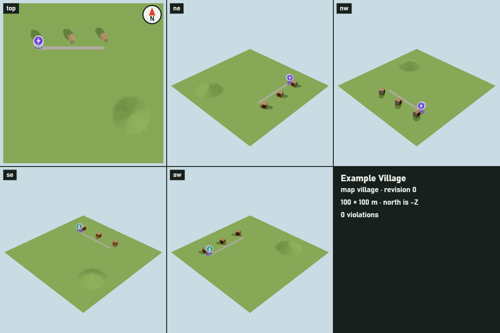
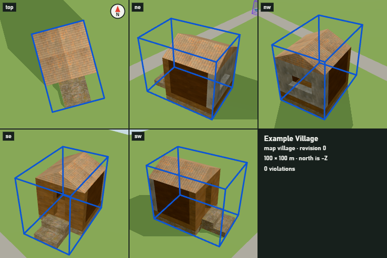
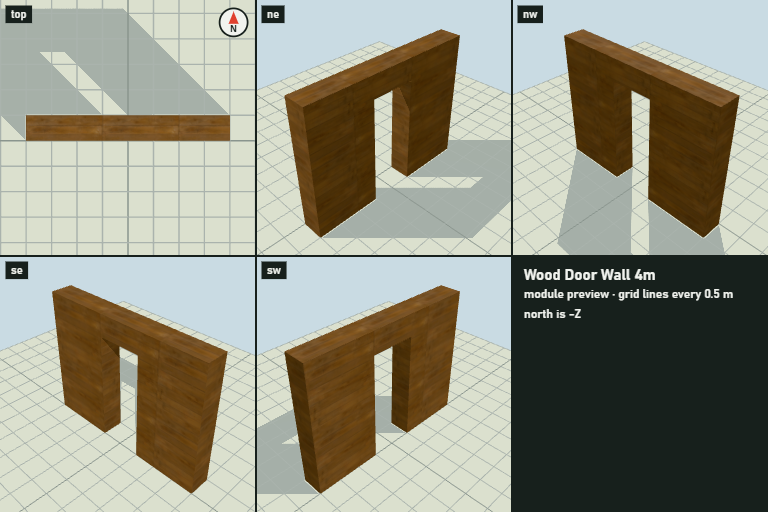
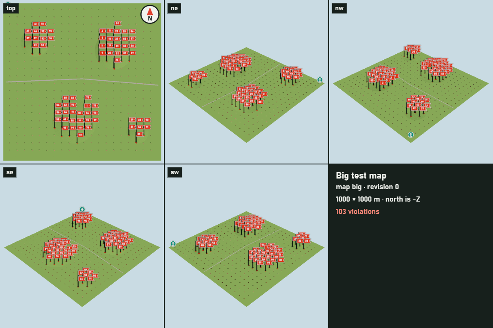

# Frontend implementation status

`packages/web` is the browser editor and the `/render` screenshot page. It follows
[claude-frontend.md](claude-frontend.md) and [protocol.md](../protocol.md); the backend
is not modified here.

## 目前進度

| 階段 | 狀態 | 驗收 |
|---|---|---|
| W0 骨架 | 完成 | `test/connection.test.ts`、`test/i18n.test.ts`；mock 上實際畫面 |
| W1 畫出場景 | 完成 | `test/map-view.test.ts`、`test/snapshot-index.test.ts`、`test/camera-math.test.ts`；mock、真的村莊和 1000 × 1000 公尺地圖的實際畫面 |
| W2 俯瞰操作 | 完成 | `test/overview-controls.test.ts`、`test/selection.test.ts`、`test/editor-browser.test.ts`（真的 Edge） |
| W3 編輯 | 完成 | `test/editing-logic.test.ts`、`test/edit-browser.test.ts`（mock）、`test/real-edit-browser.test.ts`（真的專案） |
| W4 違規、提示、語言 | 完成 | `test/notices.test.ts`、`test/issues-browser.test.ts`（真的 Edge，中英文） |
| W5 `/render` | 完成 | `test/render-views.test.ts`、`test/render-browser.test.ts`（頁面契約，以及真的專案透過 MCP `screenshot`、`build_module`） |
| W6 端到端 | 進行中 | |

## 每個階段完成了什麼、怎麼驗證

- **W0**：Vite 8 + TypeScript strict + three.js 的 `@mapedit/web`。根目錄 `pnpm build`
  在 `tsc -b` 之後執行 `vite build`，`tsc -b` 也型別檢查 web；ESLint 與 Vitest 的既有設定
  已涵蓋 `packages/web`。Vite 開發伺服器把 `/api`、`/assets`、`/ws` 轉給
  `MAPEDIT_BACKEND`（預設 `http://127.0.0.1:4790`），並改寫 `Host`（`changeOrigin`）
  與 `Origin`（HTTP 有帶時、WebSocket 一律）。WebSocket 客戶端：`hello` → `welcome` →
  `openMap`，斷線後退避重連並重新開啟目前的地圖；格式不明的伺服器訊息直接忽略。
  畫面左上角的「圖框」顯示專案名稱、地圖、版次和連線狀態，並可切換語言。
  驗證：`connection.test.ts` 用假 socket 測流程、重連、request 編號、版本不相容，
  另外對真的 mock 伺服器測 `welcome`/`scene`/`history` 和伺服器重啟後自動重連；
  瀏覽器預覽 `pnpm mapedit dev --mock` + Vite，畫面顯示 Mock project、Mock village、
  版次 0、即時同步。

- **W1**：`MapView` 把快照畫成 three.js 物件：地形切塊（同一種地表共用一個材質）、
  模組（每個模組類型的每個 primitive 一個 `InstancedMesh`）、地基延伸、點標記（地面圓盤、
  朝向箭頭、桿子）和方形標記（半透明方塊加邊線），標記上方有固定螢幕大小的圖示。
  太陽依 `azimuth`/`elevation` 打光並投影，陰影範圍跟著鏡頭。glb 以網址快取，新快照只載入
  網址變了的地形切塊、模組類型和地基延伸；模組矩陣、標記和違規標示每次重算；不再被引用的
  glb 會釋放。換地圖時先清掉舊地圖。找不到模組類型（或 glb 載入失敗）的模組畫成紅色半透明
  方塊，不會整個消失。違規：紅色玻璃方塊和紅框包住相關物件，`location` 插上編號的測量旗，
  遠的旗子會縮小。標題列可以切換地圖，載入中顯示進度。
  驗證：`map-view.test.ts` 對 mock 伺服器的真 glb 測每一種資料、點選、只重新載入變動的部分、
  釋放不用的 glb、換地圖；瀏覽器實測 mock、`pnpm e2e` 的村莊（貼圖、轉 15/30 度的房子、山、
  道路），以及 1000 × 1000 公尺、1,024 個地形切塊、400 棟房子（3,200 個模組）、103 個違規的
  地圖：伺服器建好之後 9.4 秒載完 1,090 個 glb；看整張地圖時每個畫面中位數 8.7 ms、
  90% 在 12 ms 內（`gl.finish()` 計時，含陰影，2,311 次 draw call、400 萬個三角形）。
- **W2**：鏡頭是遊戲式的狀態（看著的地面點、方位角、俯角、距離）。右鍵拖曳轉動（地圖跟著游標走）、
  中鍵拖曳平移（抓住的地面點留在游標下）、WASD／方向鍵平移（速度跟距離成正比）、滾輪往游標縮放
  （游標下的點不動）、F 平滑飛到選取的東西（沒有選取就看整張地圖；系統設定減少動態時直接跳過去）。
  看的點不能離開地圖超過地圖邊長的 10%（至少 10 公尺），距離和俯角有上下限，看的點會貼著地形高度。
  滑過時顯示名牌（種類、名稱、所屬結構、違規數），並用細的粉線藍框標出「現在點下去會選到什麼」。
  點選：第一次選整個結構，再點同一個結構裡的模組就只選那個模組；標記直接選；點空地或 Esc 取消。
  底部的動作列顯示選取的東西和能用的按鍵，沒有選取時顯示怎麼看地圖。
  驗證：`overview-controls.test.ts` 測轉動方向和上下限、平移時抓住的點不動、WASD 方向、縮放時游標下的點不動、
  不會飛出地圖、平滑對焦；`selection.test.ts` 測點選規則、Agent 刪掉選取的東西時清掉選取、名牌與按鍵提示；
  `editor-browser.test.ts` 用 Vite 建置後由 mock 伺服器提供、在 headless Edge 裡用真的滑鼠和鍵盤測：
  名牌、結構→模組選取、標記選取、點空地取消、Esc、F 對焦、右鍵轉動、中鍵平移、滾輪縮放、WASD，且沒有頁面錯誤。
- **W3**：在結構或標記上按住左鍵拖曳，出現半透明的預覽（用模組真正的形狀；標記用方塊）和
  0.5 公尺的吸附格子。每個畫面最多送一個 `previewEdit`；還沒收到回覆時只保留最新的一個，
  完全沒變的位置不重送。預覽的位置以後端回的 `transform` 為準（對齊格子、高度由後端決定）。
  `ok` 為 false 時預覽變紅，游標旁出現紅色名牌：「放不下」和違規種類（中文）加上後端的英文訊息。
  放開時送 `applyEdit`（帶開始拖動時的 `baseRevision`），預覽留著直到新的快照到達；
  被拒絕就讓預覽消失、物件留在原處，並跳出提示和原因。Esc 取消拖動。
  R（Shift+R 反方向）：拖動中轉預覽（繞著游標點轉，物件留在游標下）；沒有拖動時把選取的結構或
  標記繞著自己的中心轉 15 度並直接套用。選到模組時，拖動和 R 作用在它所屬的整個結構。
  Delete／Backspace 刪除選取的結構、單一模組或標記；Ctrl+Z 復原，Ctrl+Y 或 Ctrl+Shift+Z 重做，
  按住鍵不放不會重複套用。右上角的「修改紀錄」列出每次修改是人還是 Agent、時間（本地時間）、
  做了什麼（人的移動和刪除顯示物件名稱，Agent 的修改顯示改了哪些檔案），虛線標出目前停在哪一步，
  已復原的項目變淡；面板可以收起（記在 localStorage，讀寫都包 try/catch），上面也有復原、重做按鈕。
  驗證：`editing-logic.test.ts` 測預覽節流（一次只有一個在路上、只留最新的、不重送、離線不送）、
  旋轉數學和修改紀錄的文字；`edit-browser.test.ts` 在 headless Edge 對 mock 測拖動成功（有預覽、
  有 `previewResult`、放下後位置對齊 0.5 公尺、紀錄出現「人」）、拖到地圖外變紅並顯示原因、
  放下被拒絕彈回並提示、R、拖動中 R、Delete、Ctrl+Z、Ctrl+Y、Ctrl+Shift+Z（沒有可重做的提示）、
  按鈕復原、第二次點選後只刪單一模組、Esc 取消拖動；`real-edit-browser.test.ts` 對 `templates/project`
  的真專案測同樣的流程：拖動後 `house.yaml` 的 `position` 更新且開頭的註解還在、R 寫入
  `rotation: 15`、刪掉 `stairs` 後 Ctrl+Z 復原、拖動出生點後 `properties` 不變，以及手動改 YAML
  （模擬 Agent）時網頁即時更新、紀錄記成 Agent。
- **W4**：左邊「違規」面板依快照順序列出每一筆違規，編號和地圖上的旗子一致：違規種類（介面語言）、
  相關物件名稱、後端的訊息和建議、來源 `檔案:行`；檔案錯誤另列，顯示檔名和行號。點一筆違規，鏡頭飛過去，
  它的旗子變大、相關物件加上粗紅框；再點一次或 Esc 取消。沒有違規時顯示「沒有違規，可以匯出」。
  `notice` 依 `code` 翻成提示：Agent 修改（列出物件名稱，同時短暫用藍框標出被改的物件，連續修改會合併成
  一則）、人的修改被 Agent 蓋掉、人蓋掉 Agent 的修改、修改被拒絕（和拖動結果共用同一則，不會重複）、
  檔案無法讀取（同一個錯誤在修好前只提示一次，因為後端每次重建都會重送）。後端的英文訊息有額外資訊時當作細節顯示。
  語言：預設跟瀏覽器（任何中文都用繁體中文），標題列可以切換，記在 `localStorage`（讀寫都包 try/catch），
  切換時所有介面文字（包含已經顯示的提示）都跟著換，`<html lang>` 也更新。
  驗證：`notices.test.ts` 測每一種 notice 兩種語言的文字、細節和合併鍵、檔案錯誤只提示一次、每一種違規的名稱、
  物件清單過長時縮短；`issues-browser.test.ts` 在 zh-TW 的瀏覽器裡測：預設繁體中文、七種違規都列出來（含建議和
  來源行號）、檔案錯誤、點違規後鏡頭移動並標出物件、Esc 取消、用 `POST /api/mock/trigger` 觸發五種 notice 都有
  正確的中文提示、切到英文後標題列、面板、動作列、違規名稱、已顯示的提示都變英文，重新整理後還是英文。
  合併 `backend`（F17–F23 與地形材質修正）之後，違規的訊息改成依 protocol.md 第 3 節的 `params` 翻譯：
  七種違規都有兩種語言的說明（例如「結構位置 (60.25, 10) 不在 0.5 公尺的格子上」「超出地圖東邊 1 公尺」
  「插槽類型 roof 和 stair 不能接在一起」）；不在格子上、角度、超出地圖這三種直接寫在檔案裡的值，建議也由
  `params` 產生（「改成 (60.5, 10)」「往西移 1 公尺，就會回到地圖裡」），其他建議沿用後端的英文。
  `params` 不符合表格時（用 `violationParamsProblems` 檢查）退回後端的英文訊息。拖動時游標旁的原因也用同一套翻譯。
- **W5**：`/render` 和編輯器共用同一份 bundle（依網址載入不同的程式，截圖頁不載入任何介面和樣式）。
  頁面一開就把 `mapeditRenderReady` 設成 false，用 `GET /api/scene` 載入快照和所有 glb 之後設成 true；
  WebGL 建不起來或地圖不存在時也會設成 true，讓 `mapeditRender` 直接丟出清楚的錯誤，不會讓後端等到逾時。
  `mapeditRender(spec)`：等快照的 revision 到 `minRevision`（每 100 ms 重新抓，最多 20 秒），依
  `showViolations`（預設 true）畫違規、用粉線藍框標出 `highlight`，每個角度畫一格：`top` 用正交鏡頭從
  正上方看、北方朝上；`ne`、`nw`、`se`、`sw` 從那個方位、高度角 35 度的上空看中心。有 `focus` 就照
  它取景，沒有就取整張地圖（`top` 框住地圖的長方形，斜角在不切到角落的前提下拉近）。一到三個角度排成一列，
  四、五個排成兩列；每格左上角標角度名稱，`top` 右上角畫指北針；多出來的格子寫地圖名稱、revision、大小、
  違規數。沒有地形的地圖（`build_module` 的預覽）會加上地面和 0.5 公尺格線。頁面上沒有任何元素，
  所有資源都是同一個來源（貼圖、圖示、字都在執行時畫）。
  驗證：`render-views.test.ts` 測鏡頭方向（top 北上東右、四個斜角在對的方位）、取景、排版；
  `render-browser.test.ts` 用和後端一樣的方式（擋掉非同源請求）打開 `/render`：頁面沒有元素、拼圖大小、
  角度標籤、指北針、俯視中央是地形、`showViolations` 和 `highlight` 有作用、`minRevision` 會等到新版本、
  錯誤的參數和不存在的地圖會回錯誤訊息；並對 `templates/project` 的真專案用 MCP SDK 呼叫 `screenshot`
  （整張地圖 5 個角度、單一結構 2 個角度）和 `build_module`，都拿到 PNG 圖片、沒有 `structuredContent`。
  實測（這台 Windows、headless Edge、GPU）：village 整張 1.2 秒、單一結構 1.0 秒、模組預覽 0.7 秒、
  1000 × 1000 公尺地圖 3.2 秒（從啟動伺服器、第一次建置算起）。下面是真的伺服器透過 MCP `screenshot`
  拿到的圖：

  整張村莊（`{"map":"village","tileSize":384}`）：

  

  單一結構（`{"map":"village","structure":"house_centre","tileSize":256}`）：

  

  `build_module` 的模組預覽（`{"module":"wall_door"}`）：

  

  1000 × 1000 公尺、400 棟房子、103 個違規的地圖（`{"map":"big","tileSize":384}`）：

  

## 自行決定的事

- 打包後的 JS/CSS 放在 `dist/static/`，因為 `/assets/` 是後端產生 glb 的網址；
  後端遇到 `/assets/` 找不到就回 404，不會落到前端靜態檔。
- 只用系統字型：標題與標籤用 Bahnschrift（Windows 內建的 DIN 字體）、內文用
  Segoe UI／系統字型、數字與檔名用 Cascadia Mono／Consolas，中文退回微軟正黑體或蘋方。
- 視覺方向「測量員的現場標籤」：墨綠黑與粉筆白的標籤面板，粉線藍（木工彈線的藍色粉）
  只用在選取和吸附，旗紅只用在違規，琥珀色用在警告。
- 地圖可以用網址 `?map=<id>` 指定；沒有指定或不存在時開第一張。
- 沒有拖動時按 R，結構繞著自己的中心轉（不是繞原點），所以房子在原地轉；新原點由前端算好再交給後端對齊。
- 拖動時物件跟著「抓住的地面點」走：送出的 `position` 是游標下的地面點加上抓住時的偏移，也就是物件原點的位置，
  和 `applySourceEdit` 寫回 YAML 的 `position` 意義相同。
- 拼圖的排法：一到三個角度一列，四、五個兩列（5 個角度時多出的一格放地圖資訊），比全部排成一列更適合
  Agent 讀圖（圖片會被縮到長邊約 1,500 像素，兩列時每格比較大）。
- Agent 修改物件時，除了提示，還用藍框把被改的物件標出 1.6 秒，方便人在旁邊看 Agent 蓋東西。
- 左鍵在空地上拖曳也會平移地圖（像網頁地圖），方便沒有中鍵的觸控板；在物件上拖曳留給 W3 的移動。
- 太陽方位角：從上往下看、從北方順時針量（0 度北方 −Z、90 度東方 +X），已寫進 protocol.md
  第 2 節並通知後端。點標記 `rotation` 為 0 時面向南方 +Z（glTF 的前方，也和 Minecraft 的
  yaw 0 相同），一併寫進 protocol.md。
- 違規的物件用「建造遊戲放不下去」的語彙標示：紅色半透明方塊加紅框，而不是只把顏色變紅
  （有貼圖的模組乘上紅色會變成褐色，看不出來）。

## 需要後端配合

- 地形切塊 glb 的材質沒有設定 `metallicFactor`（glTF 預設 1），地形變成金屬、陰影全黑：
  後端在 64be461 修好，已合併，前端的暫時做法已拿掉。
- 太陽方位角和點標記朝向的定義寫進 protocol.md 第 2 節：後端在 f932de1 讓 `docs/map-format.md` 和
  Agent 說明書一致，已合併。
- F19（mock 標記高度）、F21（ref 失效不斷線）、F23（違規 params）都已合併進 `frontend`。
- 請「項目後端修正」在 `ScreenshotService` 啟動瀏覽器時加上 `--enable-unsafe-swiftshader`：這台有 GPU，
  不需要；但沒有 GPU 的機器（例如 GitHub 的 Ubuntu runner）上，新版 Chrome 可能要這個參數才肯用軟體 WebGL。

## 需要人處理

（目前沒有）

## 已知問題

（目前沒有）
